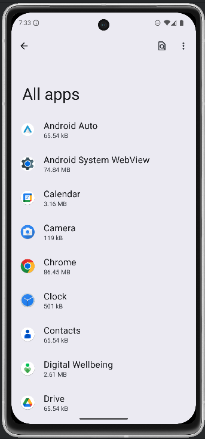
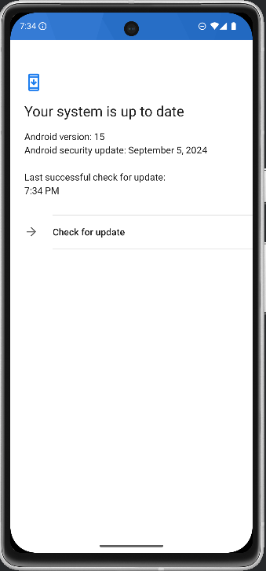
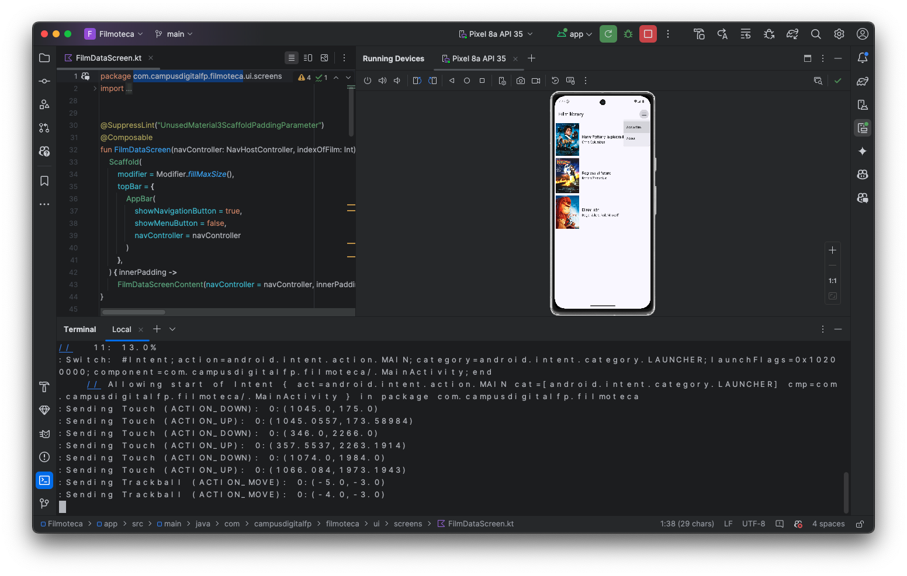
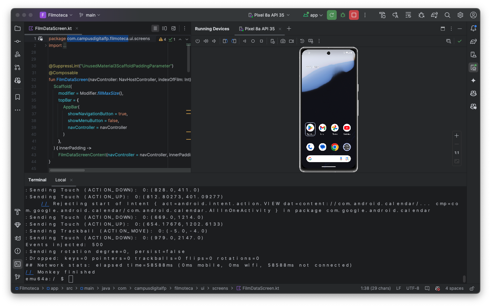

# filmoteca
Proyecto android de DAM
## Ejercicio 1

## Ejercicio 2

## Ejercicio 22
Se ejecuta Android Monkey desde el dispositivo (a través de Android Debug Brige) mediante el siguiente comando
```bash
monkey -p com.campusdigitalfp.filmoteca -s 2025 --throttle 500 500
```

