# filmoteca
Proyecto android de DAM
## UD02 Android básico
### Ejercicio 1
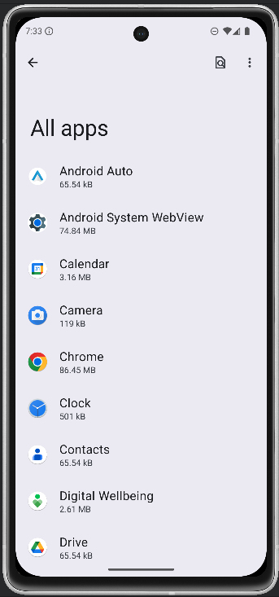
### Ejercicio 2
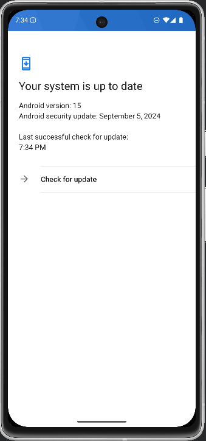
### Ejercicio 22
Se ejecuta Android Monkey desde el dispositivo (a través de Android Debug Brige) mediante el siguiente comando
```bash
monkey -p app.is_mobile.filmoteca -s 2025 --throttle 500 500
```
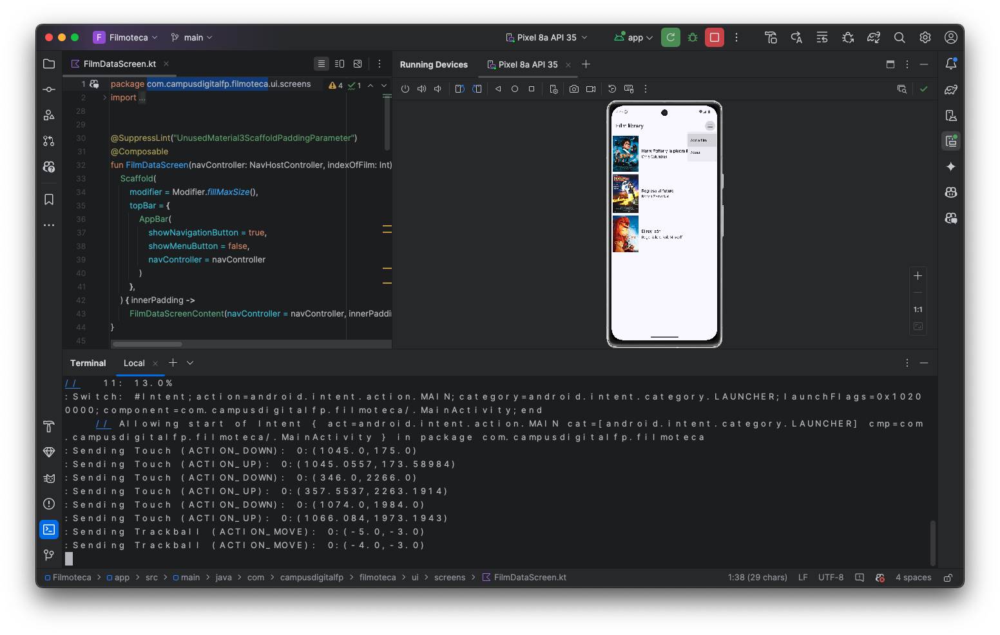
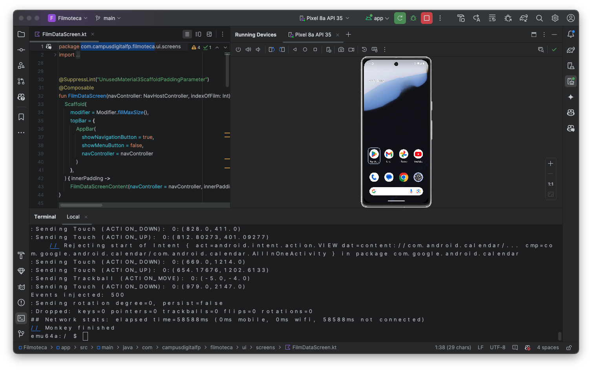

## UD03 Android Avanzado
### Ejercicio 1
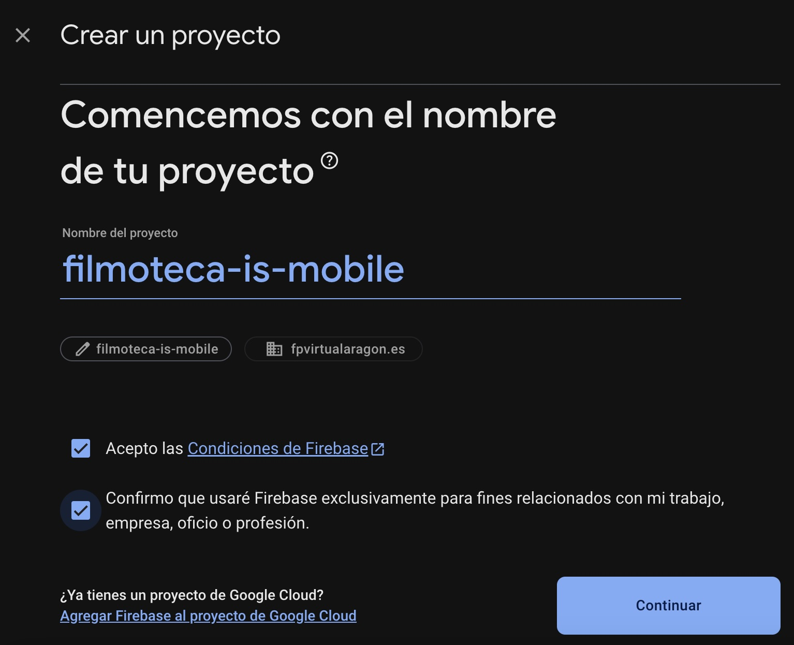
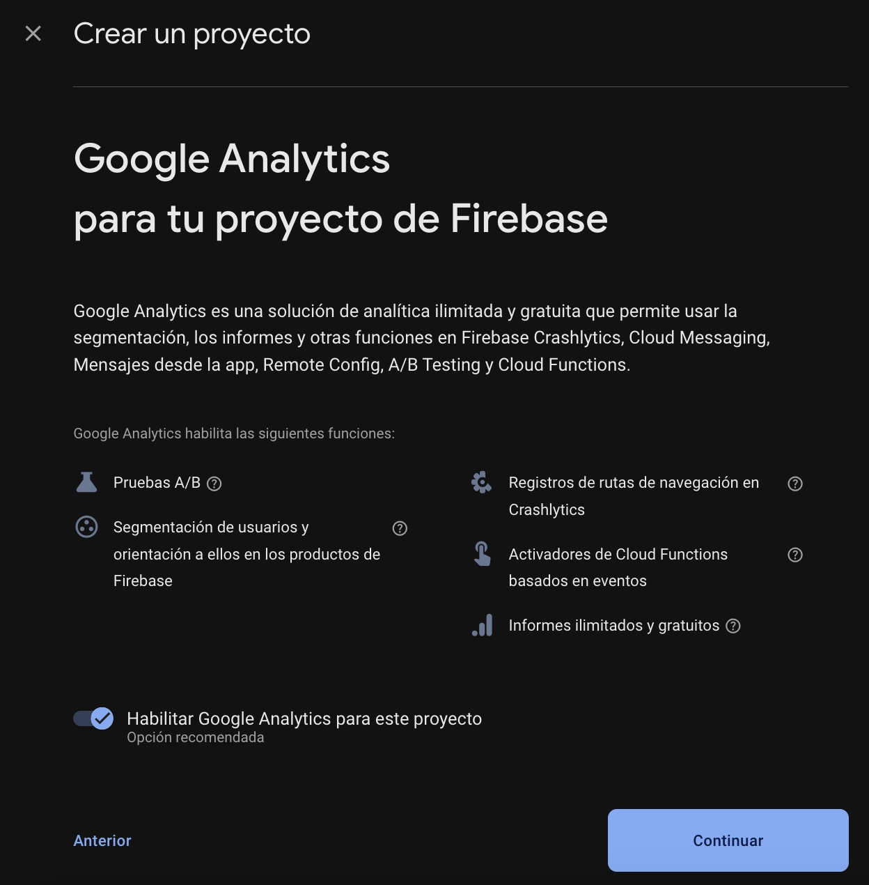
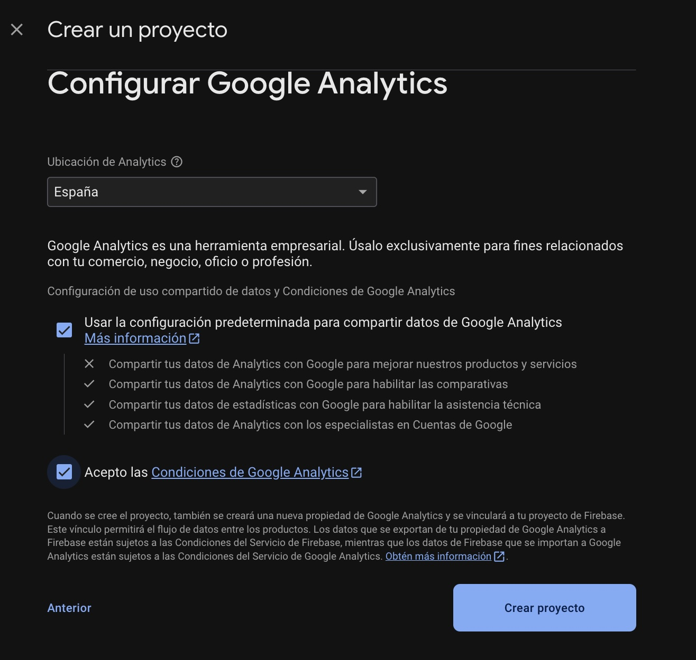
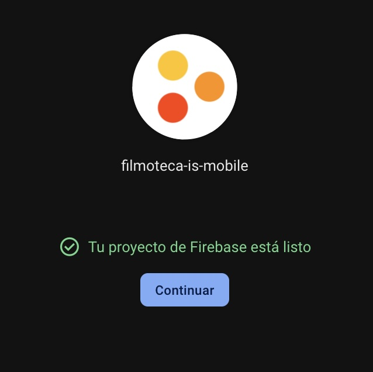

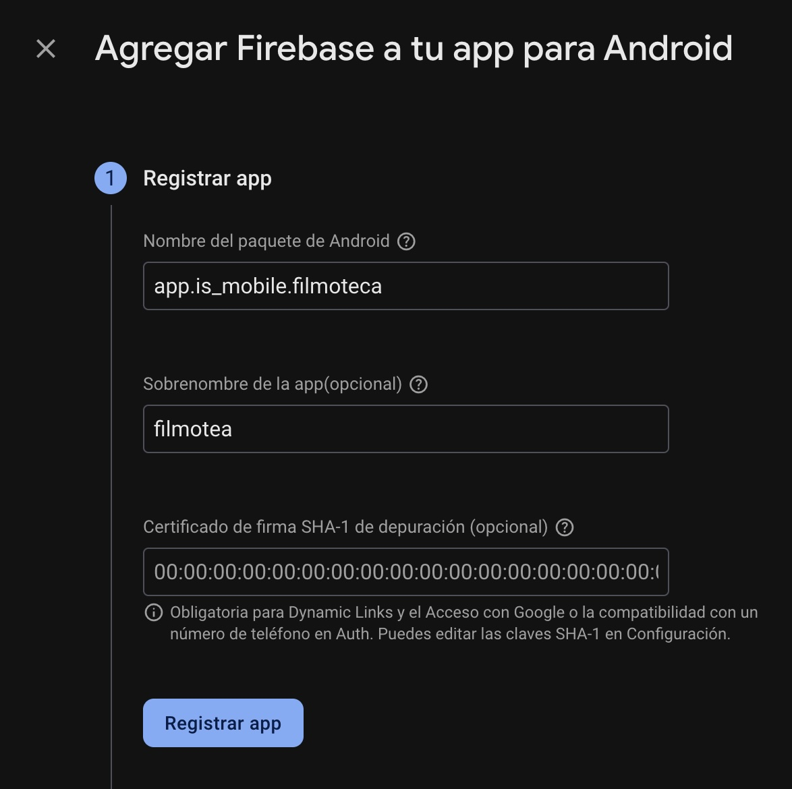
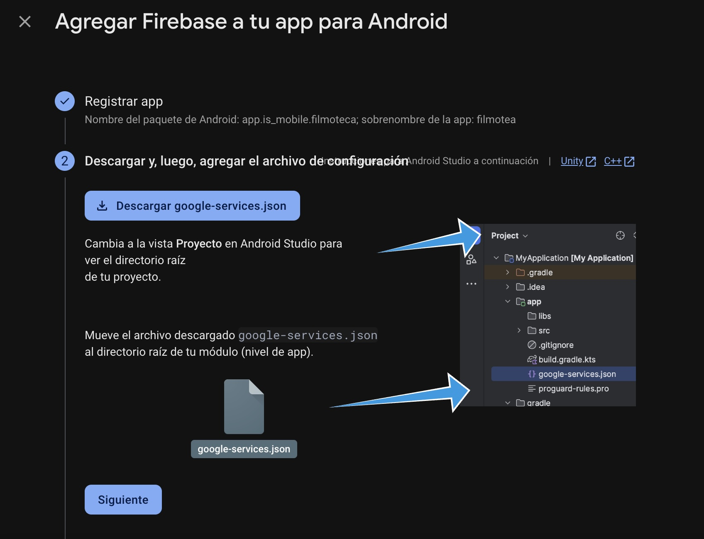
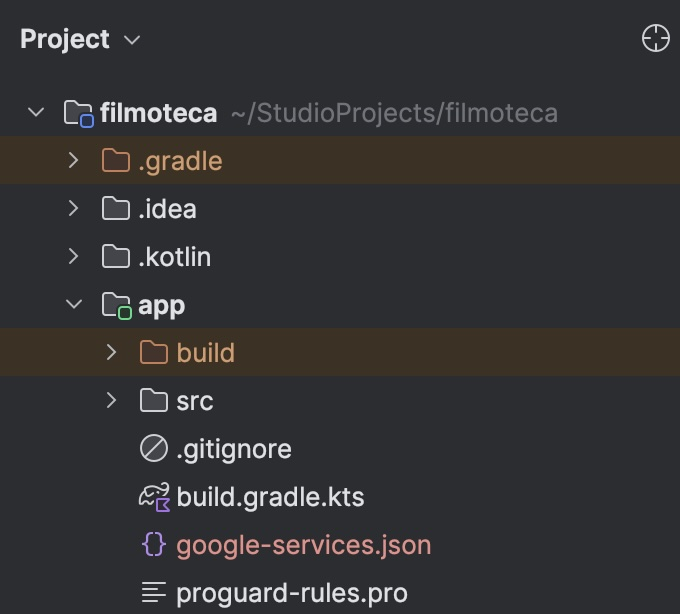
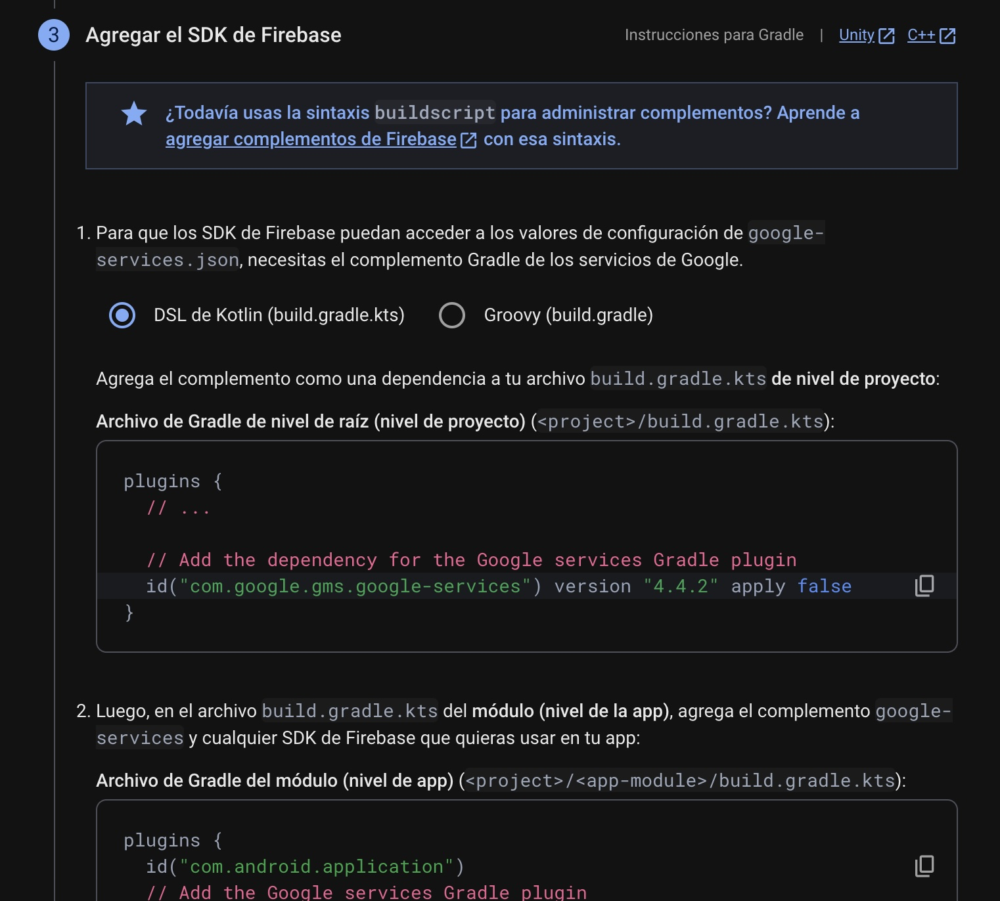
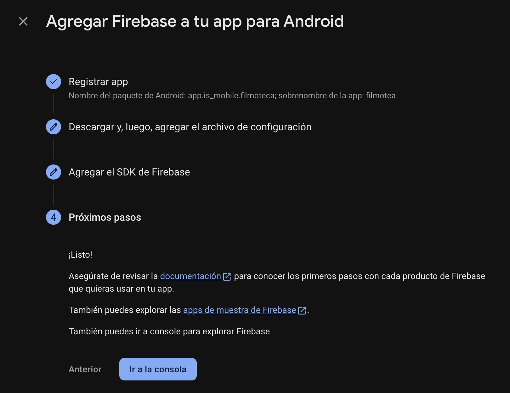