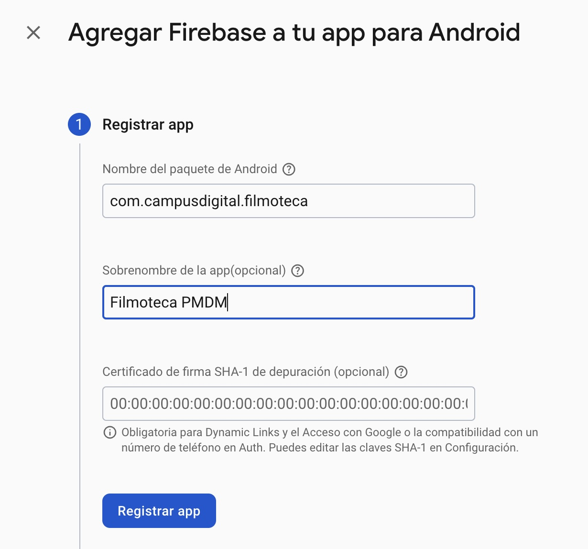
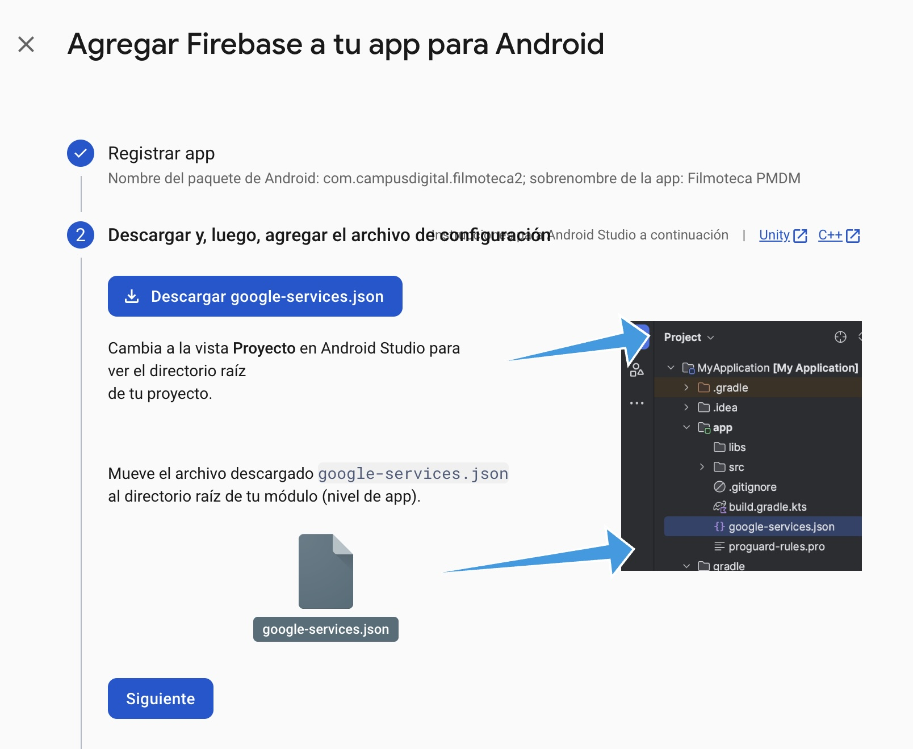
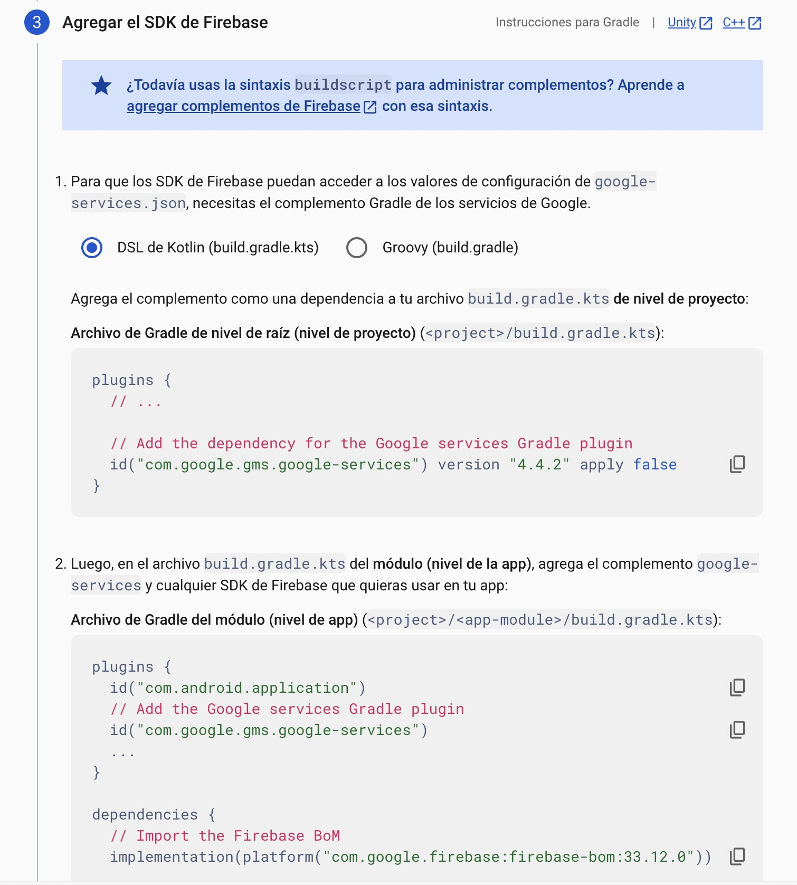
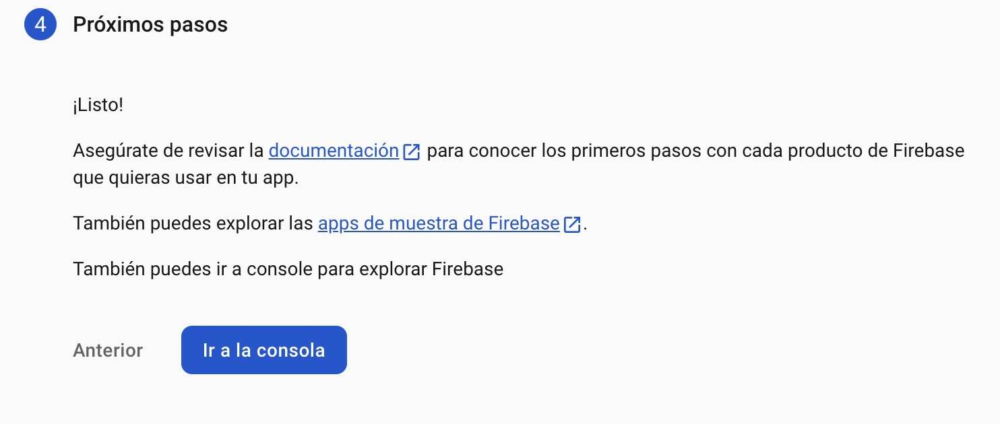

# filmoteca
Proyecto android de DAM
## UD02
### Ejercicio 1

### Ejercicio 2

### Ejercicio 22
Se ejecuta Android Monkey desde el dispositivo (a través de Android Debug Brige) mediante el siguiente comando
```bash
monkey -p com.campusdigitalfp.filmoteca -s 2025 --throttle 500 500
```


## UD03
### Ejercicio 2
Creación del proyecto en Firebase. Introducimos el nombre del proyecto, y aceptamos las condiciones

Habilitamos Google Analytics para obtener estadísiticas del uso del proyecto

Especifiamos la ubicación de Google Analytics y aceptamos la configuración predeterminada

Tenemos el proyecto listo para iniciar el proyecto

Iniciamos la creación de una aplicación Android, para tener acceso a Firestore, Authentication y Storage

Completamos los datos requeridos, el nombre del paquete que usaremos en Android Studio, al que le podemos poner un sobrenombre. También le podemos indicar la firma SHA-1 de un certificado, aunque se puede hacer posteriormente.

Descargamos el archivo google-services.json y lo pegamos en el directorio app de nuestro proyecto de Android Studio

Modificamos los ficheros build.gradle.kts, tanto el de Proyecto como el de Aplicación con la configuración facilitada

Ya hemos terminado de configurar Firebase para nuestra aplicación Android
